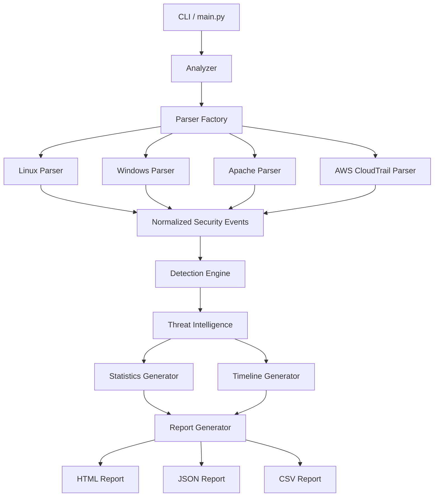
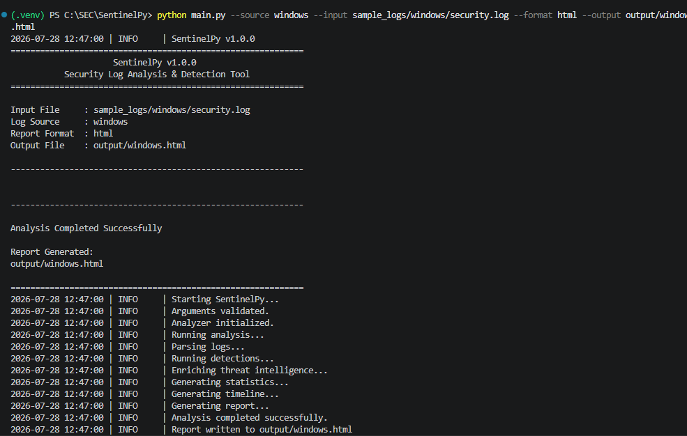
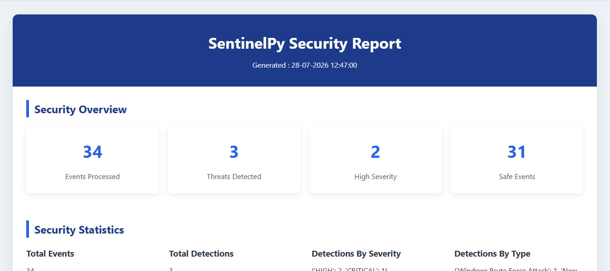
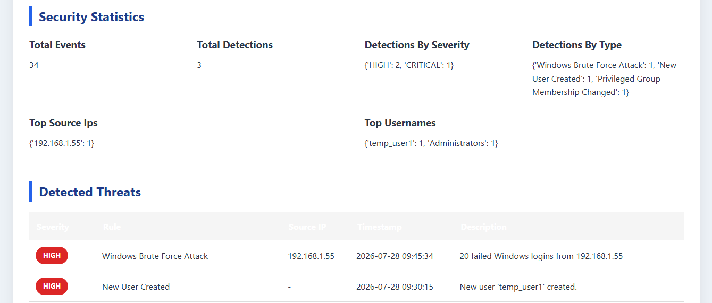
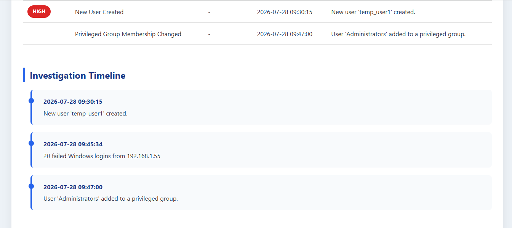

# 🛡️ SentinelPy

> A modular Security Log Analysis and Threat Detection Platform built with Python.

SentinelPy analyzes security logs from multiple sources, detects suspicious activity, enriches events with threat intelligence, generates security statistics, builds incident timelines, and produces professional reports in HTML, JSON, and CSV formats.

Designed with a modular architecture using object-oriented design principles and common software design patterns.


## Overview

SentinelPy is a Python-based Security Log Analysis and Threat Detection Platform that automates the analysis of security events collected from multiple systems.

The project parses logs from supported platforms, normalizes events into a common data model, detects suspicious behavior using configurable detection rules, enriches events with threat intelligence, generates security statistics, builds investigation timelines, and exports professional reports.

The project emphasizes clean architecture, modularity, extensibility, and testability, making it suitable as both a learning project and a portfolio demonstration of cybersecurity and software engineering skills.

## Features

| Feature | Description |
|----------|-------------|
| Multi-Source Log Parsing | Linux Authentication, Windows Security, Apache Access, AWS CloudTrail |
| Detection Engine | Modular detection rules for multiple platforms |
| Threat Intelligence | AbuseIPDB integration with caching |
| Timeline Generation | Chronological security event timeline |
| Statistics | Detection summaries and top source IP analysis |
| Reports | HTML, JSON and CSV output |
| CLI | Command-line interface |
| Modular Architecture | Easily extend parsers and detectors |
| Unit Tested | Pytest-based test suite |

## Supported Log Sources

- Linux Authentication Logs
- Windows Security Event Logs
- Apache Access Logs
- AWS CloudTrail Logs

## System Architecture



## Project Structure

```text
SentinelPy/
│
├── config/
│   ├── config.yaml
│   ├── config_loader.py
│   └── config_models.py
│
├── parsers/
│   ├── parser_factory.py
│   ├── linux_parser.py
│   ├── windows_parser.py
│   ├── apache_parser.py
│   └── aws_parser.py
│
├── detection/
│   ├── detection_engine.py
│   ├── linux_detector.py
│   ├── windows_detector.py
│   ├── apache_detector.py
│   └── aws_detector.py
│
├── threat_intelligence/
├── statistics/
├── timeline/
├── reports/
├── tests/
├── sample_logs/
├── output/
│
├── analyzer.py
├── main.py
├── requirements.txt
└── README.md
```

## Command Line Interface

SentinelPy can analyze security logs directly from the terminal.



## HTML Report

### Security Overview



### Security Statistics & Detected Threats



### Investigation Timeline



## Installation

### 1. Clone the Repository

```bash
git clone https://github.com/<your-username>/SentinelPy.git

==> For Windows

cd SentinelPy

python -m venv .venv

.venv\Scripts\activate

==> For Linux

python3 -m venv .venv

source .venv/bin/activate

Install
pip install -r requirements.txt


---

```markdown

Run SentinelPy using the command below.

```bash
python main.py \
    --source linux \
    --input sample_logs/auth.log \
    --format html \
    --output output/report.html


---

```markdown

| Argument | Description | Example |
|----------|-------------|---------|
| `--source` | Log source type | `linux` |
| `--input` | Path to input log file | `sample_logs/auth.log` |
| `--format` | Report format | `html`, `json`, `csv` |
| `--output` | Output report path | `output/report.html` |

| Source | Status |
|---------|--------|
| Linux Authentication Logs | ✅ |
| Windows Security Logs | ✅ |
| Apache Access Logs | ✅ |
| AWS CloudTrail Logs | ✅ |

## Examples

### Analyze Linux Authentication Logs

```bash
python main.py \
    --source linux \
    --input sample_logs/auth.log \
    --format html \
    --output output/linux_report.html
```

### Analyze Windows Security Logs

```bash
python main.py \
    --source windows \
    --input sample_logs/security.log \
    --format json \
    --output output/windows_report.json
```

### Analyze Apache Access Logs

```bash
python main.py \
    --source apache \
    --input sample_logs/access.log \
    --format csv \
    --output output/apache_report.csv
```

### Analyze AWS CloudTrail Logs

```bash
python main.py \
    --source aws \
    --input sample_logs/cloudtrail.json \
    --format html \
    --output output/aws_report.html
```

## Sample Output

After successful execution, SentinelPy generates reports in one of the following formats:

- HTML Report
- JSON Report
- CSV Report

Example:

```text
==================================================
SentinelPy Security Analysis
==================================================

Log Source        : Linux Authentication Logs
Events Processed  : 523
Threats Detected  : 18
Analysis Time     : 0.82 seconds

Top Threats

• Brute Force Login Attempt
• Suspicious IP Address
• Multiple Failed Logins
• Privilege Escalation Attempt

Report Saved:

output/report.html


---

```markdown
## Detection Workflow

1. Load configuration.
2. Parse raw log files.
3. Normalize events into a common event model.
4. Apply platform-specific detection rules.
5. Enrich suspicious events using threat intelligence.
6. Generate security statistics.
7. Build an event timeline.
8. Produce HTML, JSON, or CSV reports.

## Technologies Used

### Programming Language

- Python 3.12

### Core Libraries

- argparse
- logging
- pathlib
- json
- csv
- datetime
- PyYAML

### Testing

- pytest
- unittest.mock

### Software Engineering Concepts

- Object-Oriented Programming (OOP)
- Factory Design Pattern
- Modular Architecture
- Separation of Concerns
- Configuration Management
- Unit Testing
- Command-Line Interface (CLI)

### Cybersecurity Concepts

- Security Log Analysis
- Threat Detection
- Threat Intelligence Enrichment
- Event Correlation
- Timeline Generation
- Security Reporting

## Running Tests

Run all unit tests using:

```bash
pytest
```

Run with detailed output:

```bash
pytest -v
```

Generate a coverage report (if configured):

```bash
pytest --cov=.
```

## Future Enhancements

- Support for additional log sources (Syslog, Nginx, Azure, GCP)
- MITRE ATT&CK technique mapping
- YARA rule integration
- Sigma rule support
- Web dashboard for report visualization
- Docker deployment
- REST API for remote analysis
- Real-time log monitoring
- Machine learning-based anomaly detection
- Package distribution via PyPI

## Contributing

Contributions, bug reports, and feature requests are welcome.

If you would like to contribute:

1. Fork the repository.
2. Create a feature branch.
3. Commit your changes.
4. Submit a pull request.

Please ensure that new features include appropriate tests and documentation.

## License

This project is licensed under the MIT License. See the `LICENSE` file for more information.

## Author

**Anala Shasi Kumar**

- GitHub: https://github.com/shasikumaranala-lab/
- LinkedIn: https://www.linkedin.com/in/anala-shasi-kumar-8325b6290/

If you found this project helpful, consider giving it a ⭐ on GitHub.